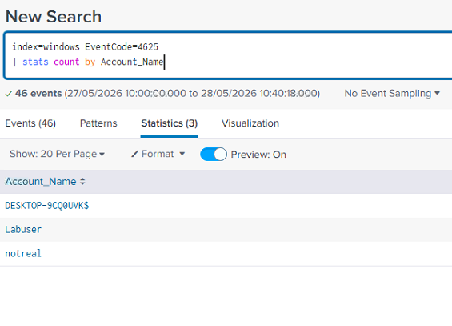
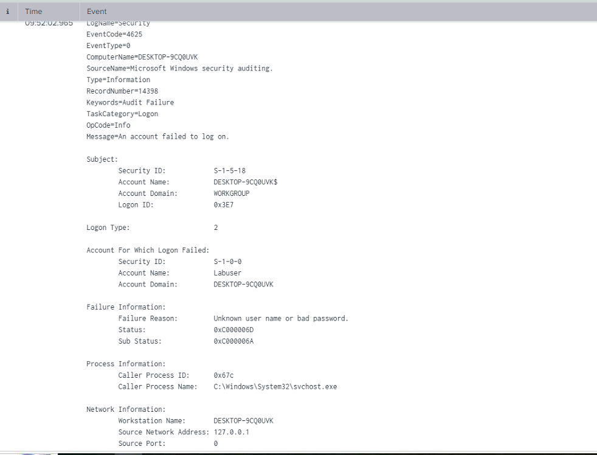
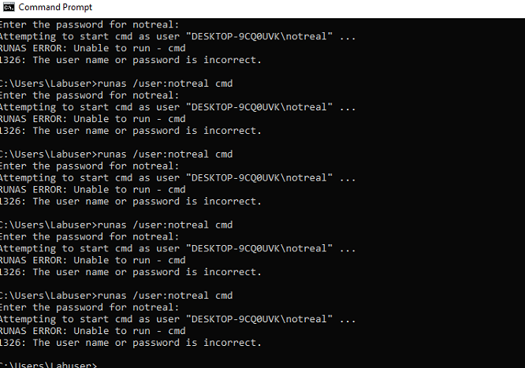
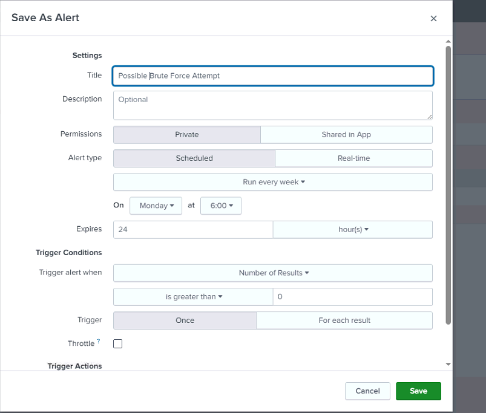
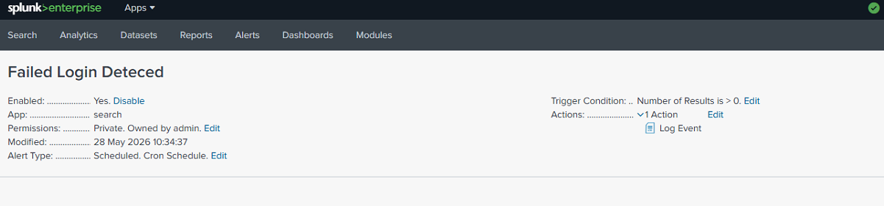
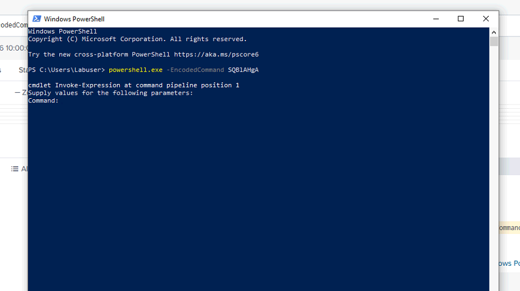
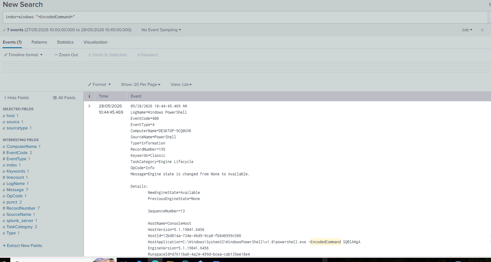
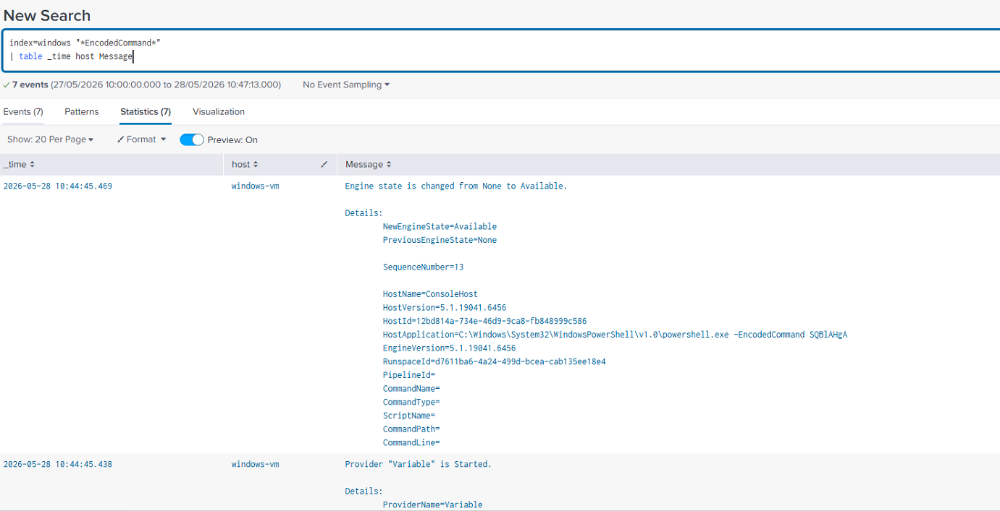
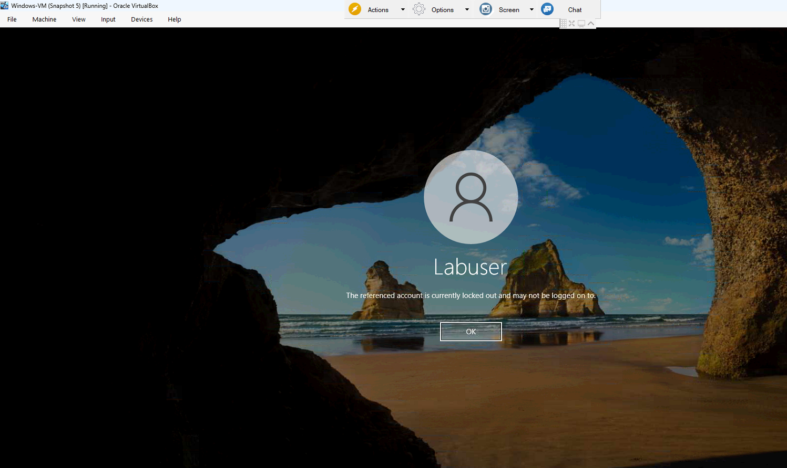

# Splunk SIEM Home Lab

## Overview

This project demonstrates a Windows SOC home lab built using:

- Splunk Enterprise
- Splunk Universal Forwarder
- Sysmon
- Windows Event Logs
- Windows 10 Virtual Machine
- VirtualBox

The lab was used to simulate and investigate:

- Failed login attempts
- Brute force activity
- PowerShell encoded command execution
- Account lockouts
- Custom alerting in Splunk

---

# Lab Architecture

- Windows 10 VM
- Sysmon installed for enhanced logging
- Splunk Universal Forwarder forwarding logs into Splunk Enterprise
- Custom searches and alerts configured in Splunk

---

# Failed Login Detection

## SPL Query

```spl
index=windows EventCode=4625
| stats count by Account_Name, Source_Network_Address
```

## Failed Login Search



## Failed Login Event Details



## Failed Login Account Summary


---

# Brute Force Simulation

Multiple failed logins were generated using:

```cmd
runas /user:notreal cmd
```

## Brute Force Simulation



---

# Splunk Alert Configuration

A custom Splunk alert was configured to detect repeated failed login attempts.

## Alert Configuration



## Alert Details



---

# PowerShell Encoded Command Detection

Encoded PowerShell commands were executed and detected inside Splunk logs.

## Encoded PowerShell Execution



## Detection Query

```spl
index=windows "*EncodedCommand*"
```

## Encoded Command Detection



## Encoded Command Investigation



---

# Account Lockout

Repeated failed authentication attempts caused the Windows account to lock.

## Account Lockout



---

# Skills Demonstrated

- SIEM Configuration
- Windows Event Log Analysis
- Threat Detection
- PowerShell Monitoring
- Sysmon Deployment
- Alert Engineering
- Splunk SPL Queries
- Security Monitoring
- Incident Investigation

---

# Author

Matt Stokes

IT Engineer | Aspiring SOC Analyst | Cybersecurity Enthusiast

## Connect With Me

- LinkedIn: https://www.linkedin.com/in/matt-stokes-95185a226/
- GitHub: https://github.com/MS241290
